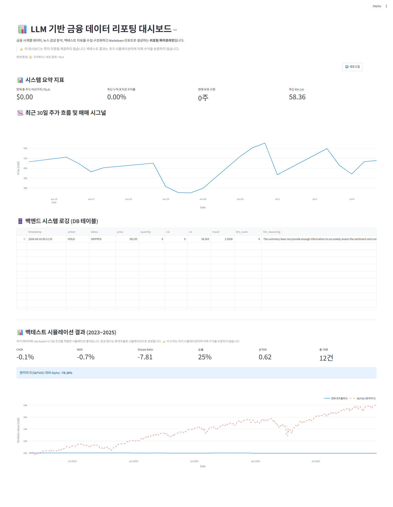
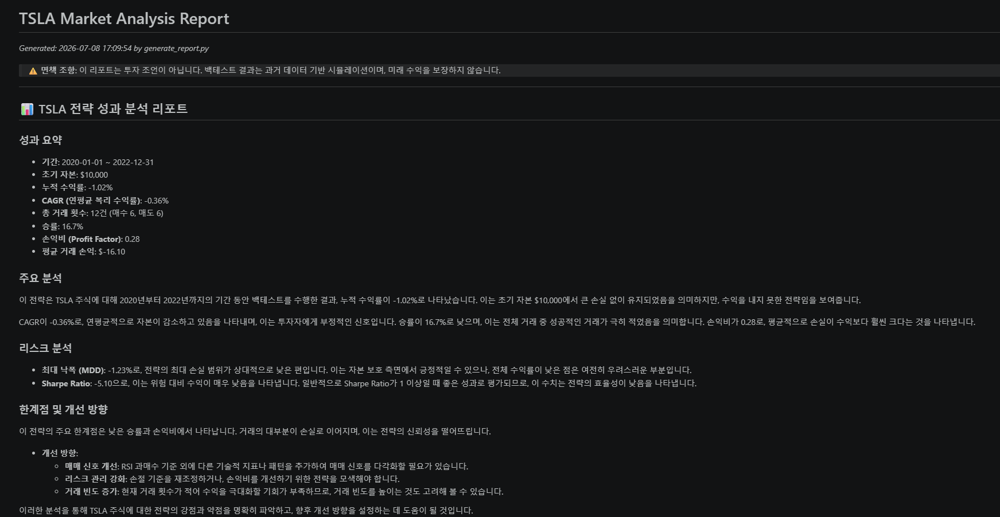

# 📊 LLM-based Financial Data Reporting Pipeline
### LLM 기반 금융 데이터 자동 리포팅 파이프라인


> ⚠️ **Disclaimer**
> 이 프로젝트는 **투자 자문, 투자 추천, 실전 자동매매 성과 검증 프로젝트가 아닙니다.**
> 금융 데이터 수집, 뉴스 감성 분석, 백테스트 지표 계산, LLM 기반 Markdown 리포트 생성을 하나의 workflow로 연결한 **리포팅 자동화 프로토타입**입니다.
> 백테스트 결과는 과거 데이터 기반 시뮬레이션이며, **미래 수익을 보장하지 않습니다.**

---

## 1. Project Summary

금융 시계열 데이터와 뉴스 감성 분석 결과를 수집·구조화하고, 백테스트 및 리스크 지표를 **LLM 기반 Markdown 리포트로 자동 생성하는 데이터 리포팅 파이프라인**입니다.

이 프로젝트의 핵심은 자동 주문이나 투자 성과가 아니라, 다음 workflow를 구현한 것입니다.

```text
Market Data Collection
→ News Sentiment Analysis
→ Backtest / Risk Metrics
→ LLM Markdown Report Generation
→ Streamlit Dashboard
→ Scheduled Batch Execution
```

### Core Message

- LLM은 매수/매도 판단 주체가 아닙니다.
- LLM은 **뉴스 감성 분석**, **출력 구조화**, **Markdown 리포트 생성**에 사용됩니다.
- KIS API 관련 코드는 이 포트폴리오의 메인 기능이 아니라 **Optional / Paper / Mock Execution** 영역으로 분리합니다.
- 이 프로젝트는 메인 AI 백엔드 포트폴리오를 보조하는 프로젝트로, **LLM 기반 데이터 자동화와 문서화 workflow** 경험을 보여주기 위해 정리했습니다.

---

## 2. Demo Screenshots

| Streamlit Reporting Dashboard | Sample Markdown Report |
| --- | --- |
|  |  |

> Note: Screenshots are used to show the reporting workflow and generated report format. The displayed metrics are based on historical simulation and are not investment advice.

---

## 3. Scope & Boundaries

### ✅ Main Scope

| 영역 | 내용 |
|------|------|
| 데이터 수집 | yfinance 주가 데이터 + Google News RSS 뉴스 헤드라인 |
| 감성 분석 | OpenAI / Ollama LLM 기반 뉴스 감성 점수 추출 |
| 데이터 검증 | JSON parsing 방어, fallback neutral sentiment, Pydantic 범위 검증 |
| 기술적 지표 | RSI(14), MACD 계산 |
| 백테스트 | Look-ahead 편향 방어, 거래비용 반영, rule-based simulation |
| 리스크 지표 | CAGR, MDD, Sharpe Ratio, 벤치마크 대비 상대 성과 비교 |
| **리포트 자동 생성** | 백테스트/리스크 지표 → LLM → Markdown report |
| 대시보드 | Streamlit 기반 리포팅 대시보드 |
| 배치 실행 | EC2 + Linux Crontab 기반 scheduled report generation |
| 테스트 | pytest 54개 단위 테스트 |

### ⛔ Out of Scope / Limited Scope

| 영역 | 설명 |
|------|------|
| Live Trading | 이 포트폴리오의 목적이 아닙니다 |
| 투자 추천 | 어떠한 매수/매도 추천도 제공하지 않습니다 |
| 성과 보장 | 백테스트 수치는 과거 시뮬레이션이며 미래 수익을 보장하지 않습니다 |
| 실거래 검증 | 실제 자금 운용 결과를 검증하는 프로젝트가 아닙니다 |
| KIS API 주문 | Optional / paper / mock execution 실험 영역으로 분리합니다 |

---

## 4. Architecture


> Main flow: **Data Collection → Sentiment Analysis → Backtest Metrics → LLM Report → Dashboard**
> KIS API 관련 코드는 optional / paper / mock execution 영역이며, 이 README의 메인 포트폴리오 범위가 아닙니다.

---

## 5. Data Pipeline

### 5.1 Price Data Collection — `data_pipeline/price_fetcher.py`

```python
df = price_fetcher.get_daily_data("TSLA", "2020-01-01", "2022-12-31")
```

- `yfinance` 기반 OHLCV 일봉 데이터 수집
- `ta` 라이브러리 기반 RSI(14), MACD_diff 계산
- 휴장일 및 결측치 방어를 위한 `ffill()` 적용
- MultiIndex 자동 평탄화

### 5.2 News Data Collection — `data_pipeline/news_fetcher.py`

- Google News RSS 기반 뉴스 헤드라인 수집
- API key 없이 동작 가능한 RSS crawling 구조
- 빈 응답, timeout, parse error, request error 방어
- 수집된 뉴스는 LLM sentiment analysis 입력으로 사용

---

## 6. LLM Usage

> ⚠️ LLM은 투자 판단 주체가 아닙니다.
> LLM은 뉴스 텍스트를 감성 점수로 구조화하고, 백테스트/리스크 지표를 사람이 읽을 수 있는 Markdown 리포트로 변환하는 데 사용됩니다.

### 6.1 News Sentiment Analysis — `nlp_engine/analyzer.py`

```python
score, confidence = await analyzer.analyze_sentiment(news_text)
```

LLM은 뉴스 텍스트를 입력받아 감성 점수와 confidence를 반환합니다.

```json
{
  "sentiment_score": 0.25,
  "confidence": 82
}
```

### 6.2 LLM Output Safety

| 단계 | 방어 방법 |
|------|-----------|
| 1 | JSON mode 요청 |
| 2 | `json.loads` + `try-except` |
| 3 | Pydantic range validation |
| 4 | 실패 시 neutral sentiment fallback |

### 6.3 LLM Backend Switching

- `USE_LOCAL_LLM=False` → OpenAI API
- `USE_LOCAL_LLM=True` → Ollama local LLM

### 6.4 Markdown Report Generation — `report/llm_reporter.py`

LLM은 CAGR, MDD, Sharpe, benchmark comparison, sentiment summary 등을 입력받아 Markdown 리포트를 생성합니다.

```text
input:
  - backtest metrics
  - risk metrics
  - sentiment summary
  - simulation event summary

output:
  - structured Markdown report
  - risk notes
  - limitations
  - human-readable commentary
```

LLM 호출 실패 시 `_generate_fallback_report()`를 통해 정량 수치 기반 기본 리포트를 생성합니다.

---

## 7. Backtest and Risk Metrics

> ⚠️ 모든 백테스트 결과는 과거 데이터 기반 시뮬레이션입니다.
> 미래 수익을 보장하지 않으며, 투자 판단 근거로 사용할 수 없습니다.

### 7.1 Backtest Modes

| 모드 | 파일 | 감성 점수 생성 | 목적 |
|------|------|--------------|------|
| Rule-based Monte Carlo | `backtest/engine.py` | 정규분포 기반 synthetic sentiment | 전략 로직과 지표 계산 흐름 검증 |
| News-based Simulation | `backtest/news_backtest.py` | LLM sentiment + CSV cache | 실제 뉴스 기반 시뮬레이션 구조 검증 |

### 7.2 Look-ahead Bias Defense

```python
for i in range(len(df)):
    current_data = df.iloc[:i+1]  # 현재 시점까지의 데이터만 사용
```

각 시점에서 미래 데이터를 참조하지 않도록 순차 처리 구조를 적용했습니다.

### 7.3 Risk Metrics — `backtest/metrics.py`

| 지표 | 설명 |
|------|------|
| CAGR | 연평균 복리 수익률 |
| MDD | 최대 낙폭 |
| Sharpe Ratio | 변동성 대비 성과 지표 |
| Benchmark Comparison | S&P500 대비 상대 성과 비교 |
| Transaction Cost | 슬리피지 + 수수료 가정 반영 |

### 7.4 Parameter Sensitivity Demo — `run_backtest_demo.py`

`run_backtest_demo.py`는 수익률 튜닝 목적이 아니라, 조건 변화에 따른 지표 민감도를 비교하는 데 사용합니다.

| 파라미터 | 조건 A | 조건 B | 분석 목적 |
|----------|--------|--------|----------|
| Allocation ratio | 10% | 30% | 자금 투입 비율 변화에 따른 지표 민감도 |
| Negative sentiment threshold | score < 0 | score < -0.3 | 감성 필터 민감도 |
| Minimum holding period | 0일 | 5거래일 | 신호 안정성 비교 |

---

## 8. Report Generation ⭐

이 프로젝트의 핵심 기능입니다.

### 8.1 Report Generation Flow

```text
Backtest Metrics
+ Risk Metrics
+ Sentiment Summary
+ Simulation Event Summary
        ↓
LLMReporter.generate_report()
        ↓
Markdown Report
```

생성되는 리포트는 다음 구조를 가집니다.

```text
1. Data Summary
2. Indicator Summary
3. News Sentiment Summary
4. Backtest Metrics
5. Risk Notes
6. LLM-generated Commentary
7. Limitations
```

### 8.2 CLI Usage

```bash
# 기본 실행
python generate_report.py --ticker TSLA

# 기간 지정
python generate_report.py --ticker TSLA --start 2020-01-01 --end 2022-12-31

# 뉴스 캐시 기반 리포트 생성
python generate_report.py --ticker TSLA --start 2020-01-01 --end 2022-12-31 --use-news-cache

# 로컬 LLM 사용
python generate_report.py --ticker TSLA --local-llm

# 출력 경로 지정
python generate_report.py --ticker TSLA --output reports/generated/report_TSLA.md
```

출력 예시:

```text
reports/generated/report_TSLA_YYYYMMDD_HHMMSS.md
```

### 8.3 Sample Report

포트폴리오용 샘플 리포트:

```text
reports/sample_market_report.md
```

GitHub에서 확인:

[reports/sample_market_report.md](reports/sample_market_report.md)

### 8.4 Fallback Report

LLM API 장애 또는 JSON parsing 실패 시, 정량 수치만으로 기본 리포트를 생성하여 전체 파이프라인이 중단되지 않도록 구성했습니다.

---

## 9. Dashboard

Streamlit 기반 리포팅 대시보드입니다.

```bash
streamlit run app.py --server.port 8501
```

| 섹션 | 내용 |
|------|------|
| 📊 시스템 요약 지표 | 리포팅 파이프라인 실행 상태와 주요 지표 카드 |
| 📈 주가 흐름 시각화 | 30일 종가 + rule-based signal marker |
| 🗄️ 이벤트 로그 | SQLite 기반 파이프라인 실행 및 시뮬레이션 이벤트 로그 |
| 📊 백테스트 시뮬레이션 | 에쿼티 커브, CAGR/MDD/Sharpe 카드, 벤치마크 비교 |

- `st.cache_data(ttl=3600)` 기반 백테스트 결과 캐싱
- 스키마 변경 시 `KeyError`를 방지하기 위한 방어적 컬럼 처리
- 대시보드는 실거래 모니터링 도구가 아니라, 리포팅 파이프라인 결과 확인용 UI입니다.

---

## 10. Testing

```bash
pytest tests/ -v
```

```text
54 passed
```

| 테스트 파일 | 케이스 수 | 검증 대상 |
|-------------|----------|----------|
| `test_analyzer.py` | 10개 | LLM JSON parsing, range validation, timeout fallback |
| `test_decision_tree.py` | 14개 | rule-based signal boundary cases |
| `test_backtest.py` | 22개 | CAGR/MDD/Sharpe 계산, look-ahead 방어 |
| `test_news_fetcher.py` | 5개 | 뉴스 크롤링 실패 방어 |
| `test_db_logger.py` | 3개 | SQLite logging integrity |

---

## 11. Deployment / Batch Execution

### 11.1 Local Setup

```bash
git clone https://github.com/bae-kh/llm-financial-reporting-pipeline.git
cd llm-financial-reporting-pipeline

python3 -m venv venv
source venv/bin/activate

pip install -r requirements.txt
cp .env.example .env
```

### 11.2 Environment Variables

| 변수 | 설명 |
|------|------|
| `OPENAI_API_KEY` | LLM sentiment analysis and report generation |
| `USE_LOCAL_LLM` | `True` → Ollama, `False` → OpenAI |
| `KIS_APP_KEY` / `KIS_APP_SECRET` | Optional — paper/mock execution experiments only |
| `KIS_ENVIRONMENT` | `virtual` only for portfolio demo |
| `ALLOW_LIVE_TRADING` | `false` by default |
| `TELEGRAM_BOT_TOKEN` | Optional — pipeline execution notification |

> Portfolio default: live trading is not enabled.
> KIS-related settings are kept only for optional paper/mock execution experiments.

### 11.3 Scheduled Report Generation

```bash
# 매일 23:35 (KST) 리포트 생성 파이프라인 실행
35 23 * * 1-5 cd /home/ubuntu/llm-financial-reporting-pipeline && \
  /home/ubuntu/llm-financial-reporting-pipeline/venv/bin/python generate_report.py \
  --ticker TSLA \
  --output reports/generated/latest_report.md \
  >> cron_execution.log 2>&1
```

---

## 12. Technical Debt & Future Work

현재 인식하고 있는 기술 부채입니다.

| 기술 부채 | 영향 | 개선 방향 |
|----------|------|----------|
| signal evaluation logic 중복 | 유지보수성 저하 | `strategy/rule_engine.py`로 분리 |
| `FINNHUB_API_KEY` 미사용 | dead code | 제거 |
| `get_hourly_data()` 미사용 | dead code | 제거 또는 TODO 표시 |
| `requirements.txt` 버전 미고정 | 배포 재현성 위험 | version pinning |
| live trading과 reporting scope 혼재 | 포트폴리오 포지셔닝 혼선 | optional execution 모듈 분리 |

### Future Work

- `strategy/rule_engine.py` 분리
- `ALLOW_LIVE_TRADING=false` 기본값 고정
- `optional_execution/` 디렉토리로 KIS 관련 코드 분리
- `reports/generated/` 자동 저장 구조 정리
- report-first CLI 고도화
- generated report archive 관리

---

## 13. Limitations

1. **Not financial advice**
   이 시스템의 출력물은 투자 판단의 근거로 사용할 수 없습니다.

2. **No performance guarantee**
   백테스트 결과는 과거 데이터 기반 시뮬레이션이며 미래 수익을 보장하지 않습니다.

3. **News data bias**
   Google News RSS는 특정 언론사 편향과 수집 누락 가능성이 있습니다.

4. **LLM uncertainty**
   LLM 감성 분석 결과는 비결정적이며, 동일 뉴스에 대해 다른 점수를 반환할 수 있습니다.

5. **Hallucination mitigation is not perfect**
   JSON parsing, Pydantic validation, fallback 처리로 방어하지만 hallucination을 완전히 제거할 수는 없습니다.

6. **KIS API is not the portfolio focus**
   이 포트폴리오는 KIS API 주문 안정성이나 실전 거래 성과를 검증하는 프로젝트가 아닙니다.

7. **Single ticker scope**
   현재 TSLA 단일 종목 중심으로 구성되어 있습니다.

---

## 14. Portfolio Note

이 프로젝트는 메인 AI 백엔드 포트폴리오를 보조하는 프로젝트로, **LLM 기반 데이터 자동화와 문서화 workflow** 경험을 보여주기 위해 정리했습니다.

### Relevance to AI Backend / Data Automation Roles

| 역량 영역 | 이 프로젝트의 증명 |
|----------|-------------------|
| Python data pipeline | 금융 시계열 데이터와 뉴스 데이터를 수집하고, 분석 가능한 형태로 전처리 |
| LLM workflow | 뉴스 감성 분석, Markdown 리포트 생성, LLM output validation 적용 |
| Report automation | 백테스트/리스크 지표를 사람이 읽을 수 있는 Markdown 리포트로 변환 |
| Batch execution | Linux/EC2 환경에서 scheduled batch workflow 구성 |
| Dashboard | Streamlit 기반 리포팅 UI 구현 |
| Testing | 54개 pytest 기반 LLM parsing, backtest, DB logging 검증 |

이 프로젝트의 핵심 메시지는 다음과 같습니다.

> AI 기능은 모델 추론이나 수치 계산만으로 완성되지 않으며, 사람이 이해하고 활용할 수 있는 문서와 workflow로 연결되어야 한다.

---

## 15. Project Structure

```text
llm-financial-reporting-pipeline/
├── README.md
│
├── generate_report.py           # Main entry point — Markdown report generation CLI
├── app.py                       # Streamlit reporting dashboard
│
├── config/
│   └── settings.py              # Centralized settings
├── data_pipeline/
│   ├── price_fetcher.py         # yfinance price data + RSI/MACD
│   └── news_fetcher.py          # Google News RSS crawler
├── nlp_engine/
│   └── analyzer.py              # LLM sentiment analysis
├── database/
│   └── db_logger.py             # SQLite event logging
├── backtest/
│   ├── engine.py                # rule-based backtest
│   ├── metrics.py               # CAGR / MDD / Sharpe / benchmark comparison
│   └── news_backtest.py         # news-based simulation + cache
├── report/
│   └── llm_reporter.py          # LLM Markdown report generation
├── reports/
│   ├── sample_market_report.md  # portfolio sample report
│   └── generated/               # ignored generated reports
├── notifications/
│   └── telegram.py              # optional notification
├── docs/
│   ├── INTERVIEW_PREP.md
│   ├── portfolio_positioning.md
│   ├── portfolio_summary.md
│   └── limitations.md
├── tests/
│
│   [Optional / Paper Execution]
├── auto_trade.py                # Optional broker API / paper execution module
├── run_backtest_demo.py          # parameter sensitivity demo
│
└── requirements.txt
```

---

## 16. Engineering Challenges

### 16.1 LLM JSON Output Failure

**Problem**
LLM이 JSON 형식이 아닌 자연어 응답을 반환할 경우 `JSONDecodeError`가 발생하고 sentiment pipeline이 중단될 수 있습니다.

**Solution**

- JSON mode 요청
- `json.loads` + `try-except`
- Pydantic range validation
- 실패 시 neutral sentiment fallback

---

### 16.2 Time-series Missing Values

**Problem**
휴장일 또는 수집 지연으로 인해 OHLCV 데이터에 NaN이 발생할 수 있습니다.

**Solution**

- `ffill()` forward fill 적용
- 지표 계산 전 결측치 보정
- 시장 데이터 특성을 고려한 전처리

---

### 16.3 Look-ahead Bias in Backtest

**Problem**
백테스트에서 미래 데이터를 참조하면 실제보다 과도하게 좋은 결과가 나올 수 있습니다.

**Solution**

```python
for i in range(len(df)):
    current_data = df.iloc[:i+1]
```

각 시점에서 현재까지의 데이터만 사용하도록 제한했습니다.

---

### 16.4 Dashboard Schema Mismatch

**Problem**
DB schema 또는 DataFrame column 구성이 변경되면 Streamlit 대시보드에서 `KeyError`가 발생할 수 있습니다.

**Solution**

- 필요한 column 교집합만 선택
- 존재하지 않는 column에 대한 defensive rendering
- dashboard crash 방지
