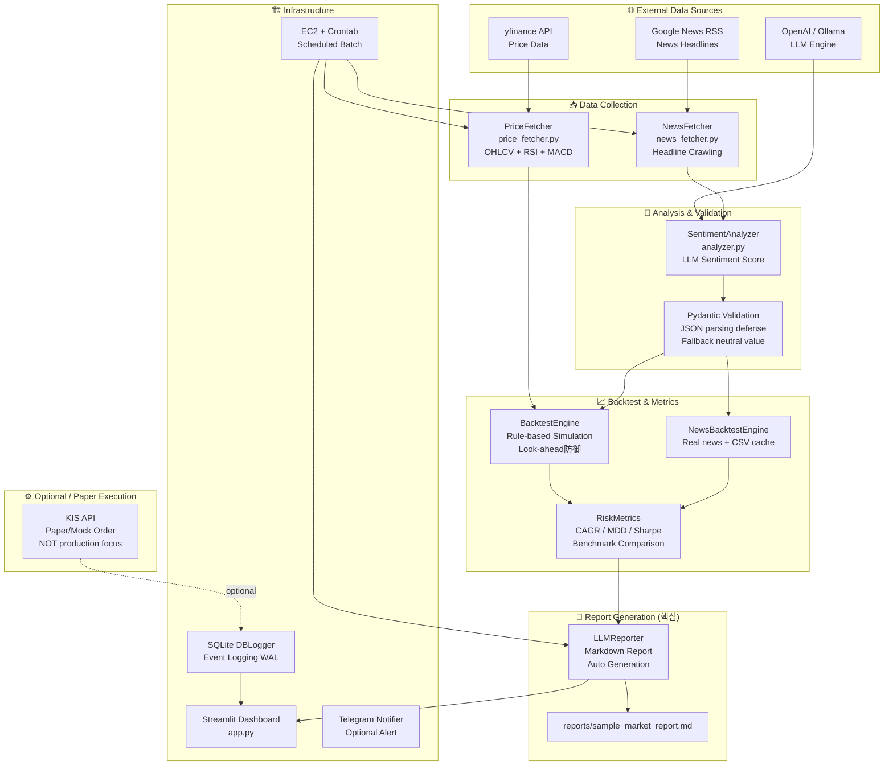

# 📊 LLM-based Financial Data Reporting Pipeline
### LLM 기반 금융 데이터 자동 리포팅 파이프라인


> ⚠️ **면책 조항**: 이 프로젝트는 **투자 자문 또는 자동매매 성과 검증 프로젝트가 아닙니다.**  
> 데이터 수집·분석·리포트 자동화 workflow를 보여주기 위한 **리포팅 자동화 프로토타입**입니다.  
> 백테스트 결과는 과거 데이터 기반 시뮬레이션이며, **미래 수익을 보장하지 않습니다.**

---

## 1. Project Summary

금융 시계열 데이터와 뉴스 감성 분석 결과를 수집·구조화하고, 백테스트 및 리스크 지표를 **LLM 기반 Markdown 리포트로 자동 생성하는 데이터 리포팅 파이프라인**입니다.

**핵심 메시지:**
- LLM은 매수/매도 판단 주체가 아닙니다. **뉴스 감성 분석**과 **Markdown 리포트 생성**에만 활용됩니다.
- 이 프로젝트의 핵심은 "데이터 수집 → 감성 분석 → 리스크 지표 계산 → 리포트 자동 생성 → 대시보드 시각화" **workflow** 구현입니다.
- NHN AI 전환 백엔드 개발 지원에서 **메인 프로젝트가 아닌 보조 포트폴리오**로 사용됩니다.

---

## 2. Scope & Boundaries

### ✅ Main Scope (이 포트폴리오의 핵심)

| 영역 | 내용 |
|------|------|
| 데이터 수집 | yfinance 주가 데이터 + Google News RSS 뉴스 헤드라인 |
| 감성 분석 | OpenAI / Ollama LLM 기반 뉴스 감성 점수 추출 |
| 데이터 검증 | JSON 파싱 방어, fallback neutral sentiment, Pydantic 범위 검증 |
| 기술적 지표 | RSI(14), MACD 계산 (rule-based signal simulation 입력용) |
| 백테스트 | Look-ahead 편향 방어, 거래비용 반영, rule-based 시뮬레이션 |
| 리스크 지표 | CAGR, MDD, Sharpe Ratio, 벤치마크 대비 상대 성과 비교 |
| **리포트 자동 생성** | LLM → 백테스트 결과 → Markdown 리포트 (핵심 기능) |
| 대시보드 | Streamlit 시각화 (에쿼티 커브, 거래 이력, 지표 카드) |
| 배치 실행 | EC2 + Linux Crontab 스케줄 실행 |
| 테스트 | pytest 54개 단위 테스트 |

### ⛔ Out of Scope / Limited Scope

| 영역 | 설명 |
|------|------|
| Live Trading | 이 포트폴리오의 목적이 아닙니다 |
| 투자 추천 | 어떠한 투자 판단도 제공하지 않습니다 |
| 성과 보장 | 백테스트 수치는 과거 시뮬레이션이며 미래 수익을 보장하지 않습니다 |
| 실거래 검증 | 실제 자금으로 거래한 결과가 아닙니다 |
| KIS API 주문 | Optional / paper execution 실험 기능으로 분리 (메인 기능 아님) |

---

## 3. Architecture



> KIS API 주문 실행은 Optional / Paper Execution 영역으로 분리됩니다. 이 파이프라인의 메인 흐름은 **Data Collection → Sentiment Analysis → Backtest Metrics → LLM Report → Dashboard**입니다.

---

## 4. Data Pipeline

### 주가 데이터 수집 — `data_pipeline/price_fetcher.py`

```python
# yfinance로 일봉 OHLCV + 기술적 지표 자동 계산
df = price_fetcher.get_daily_data("TSLA", "2020-01-01", "2022-12-31")
# → Close, RSI_14, MACD_diff 포함
```

- `yfinance` 기반 OHLCV 일봉 데이터
- `ta` 라이브러리로 RSI(14), MACD_diff 자동 계산
- 결측치 처리: `ffill()` (Forward Fill — 휴장일 시장 특성 반영)
- MultiIndex 자동 평탄화

### 뉴스 데이터 수집 — `data_pipeline/news_fetcher.py`

- Google News RSS 크롤링 (API 키 불필요)
- 최대 5개 헤드라인 수집
- 빈 응답 방어, 4종 예외 처리 (Timeout / ParseError / RequestException / 기타)

---

## 5. LLM Usage

> ⚠️ **LLM은 투자 판단을 하지 않습니다.** 뉴스 텍스트의 감성 점수를 추출하는 역할과, 백테스트 결과를 사람이 읽을 수 있는 Markdown 리포트로 요약하는 역할만 수행합니다.

### 5.1 뉴스 감성 분석 — `nlp_engine/analyzer.py`

```python
# LLM이 뉴스 텍스트를 분석하여 감성 점수만 반환
# 반환 형식: {"sentiment_score": float}  (-1.0 ~ 1.0)
score, confidence = await analyzer.analyze_sentiment(news_text)
```

**3중 방어막:**

| 단계 | 방어 방법 |
|------|-----------|
| 1 | `response_format={"type": "json_object"}` — JSON 모드 강제 |
| 2 | `json.loads` + `try-except` — 파싱 실패 시 중립값(0.0) 대체 |
| 3 | `Pydantic` 모델 — -1.0~1.0 범위 강력 검증 |

**LLM 백엔드 스위칭:**
- `USE_LOCAL_LLM=False` → OpenAI GPT-4o-mini
- `USE_LOCAL_LLM=True` → Ollama Llama3 (localhost:11434)

### 5.2 Markdown 리포트 자동 생성 — `report/llm_reporter.py`

LLM은 CAGR, MDD, Sharpe 등 백테스트 수치를 입력받아 **사람이 이해하기 쉬운 한국어 Markdown 리포트**를 자동 생성합니다.

```
input:  metrics dict (CAGR, MDD, Sharpe, Alpha, win_rate, ...) + trade log
output: 구조화된 Markdown 리포트 (성과 요약 / 리스크 분석 / 한계점)
```

LLM 실패 시 fallback: 정량 수치만으로 기본 리포트 자동 생성 (시스템 중단 없음)

---

## 6. Backtest and Risk Metrics

> ⚠️ **주의**: 모든 백테스트 결과는 과거 데이터 기반 시뮬레이션입니다. 미래 수익을 보장하지 않으며, 투자 판단 근거로 사용할 수 없습니다.

### 6.1 두 가지 백테스트 모드

| 모드 | 파일 | 감성 점수 생성 | 현실성 |
|------|------|--------------|--------|
| Rule-based Monte Carlo | `backtest/engine.py` | 정규분포 난수 N(0.1, 0.3) | 전략 로직 검증용 |
| Real News-based | `backtest/news_backtest.py` | LLM 분석 + CSV 캐싱 | 실제 뉴스 기반 시뮬레이션 |

실제 뉴스 기반 백테스트: `tesla_news_2020_2022.csv` (2,486건), 한 번 분석 후 캐싱 → 반복 실행 시 API 비용 0원

### 6.2 Look-ahead 편향 방어

```python
# 이터레이티브 순회로 미래 데이터 접근 구조적 차단
for i in range(len(df)):
    current_data = df.iloc[:i+1]  # 현재 시점까지만 접근
```

### 6.3 리스크 지표 — `backtest/metrics.py`

| 지표 | 설명 |
|------|------|
| **CAGR** | 연평균 복리 수익률 (기간 전체 성과 요약) |
| **MDD** | 최대 낙폭 — 포트폴리오 꼬리 위험(Tail Risk) 정량화 |
| **Sharpe Ratio** | 위험 대비 수익률 — 변동성 보정 후 성과 측정 |
| **벤치마크 비교** | S&P500 대비 상대 성과 비교 (Alpha 계산) |
| **거래비용** | 슬리피지 + 수수료 0.1% 반영 |

### 6.4 전략 파라미터 비교 (`run_backtest_demo.py`)

전략 조건 변화에 따른 지표 비교 실험 (수익률 극대화 목적이 아닌 **파라미터 민감도 분석**):

| 파라미터 | 조건 A | 조건 B | 분석 목적 |
|----------|--------|--------|----------|
| 투자 비율 | 10% | 30% | 자금 집중도 민감도 |
| 악재 임계값 | score < 0 | score < -0.3 | 감성 필터 민감도 |
| 최소 보유 기간 | 0일 | 5거래일 | 신호 안정성 |

---

## 7. Report Generation ⭐ 핵심 기능

이 파이프라인의 핵심 산출물입니다.

### 7.1 자동 생성 흐름

```
백테스트 결과 (metrics dict)
    + 거래 로그 (trades list)
    + 뉴스 감성 요약
        ↓
LLMReporter.generate_report()
        ↓
구조화된 Markdown 리포트
    - 성과 요약
    - 주요 분석
    - 리스크 분석
    - 한계점 및 개선 방향
```

### 7.2 CLI 실행 예시

```bash
# 기본 실행 (TSLA, 2020~2022, 몬테카를로 시뮬레이션)
python generate_report.py --ticker TSLA

# 실제 뉴스 CSV 기반 백테스트 + 리포트
python generate_report.py --ticker TSLA --start 2020-01-01 --end 2022-12-31 --use-news-cache

# 로컬 LLM(Ollama) 사용
python generate_report.py --ticker TSLA --local-llm

# 출력 경로 지정
python generate_report.py --ticker TSLA --output reports/my_report.md
```

출력: `reports/generated/report_TSLA_YYYYMMDD_HHMMSS.md`

### 7.3 샘플 리포트

실제 생성 결과 예시: [`reports/sample_market_report.md`](reports/sample_market_report.md)

### 7.4 LLM 실패 방어

LLM API 장애 시 → `_generate_fallback_report()` 자동 실행 → 정량 수치로만 기본 리포트 생성 → 시스템 중단 없음


---

## 8. Dashboard

Streamlit 기반 리포팅 대시보드 (`app.py`):

```bash
streamlit run app.py --server.port 8501
```

| 섹션 | 내용 |
|------|------|
| 📊 시스템 요약 지표 | 에쿼티 현황, 지표 카드 |
| 📈 주가 흐름 시각화 | 30일 종가 + BUY/SELL 이벤트 마킹 |
| 🗄️ 이벤트 로그 | SQLite 기반 파이프라인 실행 이력 |
| 📊 백테스트 성과 | 에쿼티 커브, CAGR/MDD/Sharpe 카드, 벤치마크 비교 |

- `st.cache_data(ttl=3600)` — 백테스트 결과 1시간 캐싱
- 방어적 컬럼 표시: 스키마 변경 시 `KeyError` 방어

---

## 9. Testing

```bash
pytest tests/ -v
# 54 passed ✅
```

| 테스트 파일 | 케이스 수 | 검증 대상 |
|-------------|----------|----------|
| `test_analyzer.py` | 10개 | LLM JSON 파싱 방어 / 범위 초과 / 타임아웃 → 중립값 대체 |
| `test_decision_tree.py` | 14개 | rule-based 시그널 경계값 (RSI, MACD, confidence) |
| `test_backtest.py` | 22개 | CAGR/MDD/Sharpe 수학적 정확성, Look-ahead 방어 |
| `test_news_fetcher.py` | 5개 | 뉴스 크롤링 실패 방어 |
| `test_db_logger.py` | 3개 | SQLite 무결성 |

---

## 10. Deployment / Batch Execution

### 환경 설정

```bash
git clone https://github.com/bae-kh/nlp-quant-trade.git
cd nlp-quant-trade
python3 -m venv venv
source venv/bin/activate
pip install -r requirements.txt
cp .env.example .env   # 실제 API 키 입력
```

### 환경 변수 (`.env.example` 참고)

| 변수 | 설명 |
|------|------|
| `OPENAI_API_KEY` | LLM 감성 분석 및 리포트 생성 |
| `USE_LOCAL_LLM` | `True` → Ollama, `False` → OpenAI |
| `KIS_APP_KEY` / `KIS_APP_SECRET` | Optional — paper/mock execution 실험용 |
| `KIS_ENVIRONMENT` | `virtual` (기본값) / `production` |
| `TELEGRAM_BOT_TOKEN` | Optional — 파이프라인 실행 알림 |

> ⚠️ `KIS_ENVIRONMENT`는 기본값이 `"virtual"` (모의 모드)입니다. 실전 전환은 명시적 설정 변경이 필요합니다.

### 배치 스케줄러 (EC2 Crontab)

```bash
# 매일 23:35 (KST) 파이프라인 실행 — 리포팅 데이터 수집 목적
35 23 * * 1-5 cd /home/ubuntu/nlp-quant-trade && \
  /home/ubuntu/nlp-quant-trade/venv/bin/python auto_trade.py >> cron_execution.log 2>&1
```

---

## 11. Technical Debt & Future Work

현재 인식된 기술 부채 목록입니다. 투명하게 공개합니다.

| 기술 부채 | 영향 | 개선 방향 |
|----------|------|----------|
| 시그널 평가 로직 3중 중복 | 유지보수성 저하 | `strategy/rule_engine.py`로 분리 |
| `FINNHUB_API_KEY` 미사용 | Dead code | 제거 |
| `get_hourly_data()` 미사용 | Dead code | 제거 또는 TODO 표시 |
| `requirements.txt` 버전 미고정 | 배포 재현성 위험 | 버전 pinning |
| live trading과 reporting scope 혼재 | 포트폴리오 포지셔닝 불명확 | 구조 분리 (진행 중) |

### Future Work (후속 작업 후보)

- `python generate_report.py --ticker TSLA --start 2020-01-01 --end 2022-12-31` CLI 추가
- `ALLOW_LIVE_TRADING=false` 기본값으로 live trading 완전 비활성화
- `strategy/rule_engine.py` 분리로 중복 제거
- `reports/generated/` 자동 저장 구조

---

## 12. Limitations

> 이 섹션은 포트폴리오를 사용하는 모든 분이 반드시 읽어야 합니다.

1. **투자 조언 아님**: 이 시스템의 출력물(리포트, 지표, 대시보드)은 어떠한 투자 판단의 근거로도 사용할 수 없습니다.
2. **성과 보장 없음**: 백테스트 결과는 과거 데이터 기반 시뮬레이션이며, 미래 수익을 보장하지 않습니다.
3. **뉴스 데이터 편향**: Google RSS는 특정 언론사 편향이 있을 수 있으며, 수집된 헤드라인이 시장 전체를 대표하지 않습니다.
4. **LLM 감성 불확실성**: LLM 출력은 비결정적이며, 동일 뉴스에 대해 다른 점수를 반환할 수 있습니다.
5. **LLM Hallucination 방어**: JSON/Pydantic/fallback 구조로 방어하고 있으나 완전 제거는 불가합니다.
6. **KIS API는 부수 기능**: 이 포트폴리오는 KIS API 주문 안정성이나 실전 거래 성과를 검증하는 프로젝트가 아닙니다.
7. **단일 종목 한계**: 현재 TSLA 단일 종목만 지원합니다.

---

## 13. Portfolio Note

### NHN AI 전환 백엔드 개발 JD와의 연결

이 프로젝트는 **LLM 기반 데이터 파이프라인과 리포트 자동화 경험**을 보여주기 위한 보조 포트폴리오입니다.

| 역량 영역 | 이 프로젝트의 증명 |
|----------|-------------------|
| **Python 데이터 파이프라인** | 수집 → 분석 → 지표 계산 → 리포팅 풀스택 구현 |
| **LLM 활용 (Agentic AI)** | 감성 분석, Markdown 리포트 자동 생성, LLM output 검증 |
| **데이터 자동화** | EC2 + Crontab 배치 스케줄링, Streamlit 대시보드 |
| **AI 문서 자동화** | LLM이 수치를 해석해 사람이 읽을 수 있는 리포트로 변환 |
| **Linux/EC2 경험** | AWS EC2 배포, 환경 변수 관리, 배치 실행 로그 |
| **테스트 전략** | 54개 pytest, LLM output 방어, 경계값 분석 |

> 메인 포트폴리오 (AI Text Moderation Backend)와 **이 보조 포트폴리오를 함께 제시**하여, Python 데이터 파이프라인 + LLM 활용 + 문서 자동화 경험을 종합적으로 어필합니다.

---

## 📁 프로젝트 구조

```
nlp-quant-trade/
├── README.md
│
├── generate_report.py           # ⭐ 메인 실행 진입점 — 리포트 자동 생성 CLI
├── app.py                       # Streamlit 리포팅 대시보드
│
├── config/
│   └── settings.py              # 중앙 집중형 설정 허브 (환경 분기 + 전략 파라미터)
├── data_pipeline/
│   ├── price_fetcher.py         # yfinance 시계열 데이터 + RSI/MACD
│   └── news_fetcher.py          # Google News RSS 뉴스 크롤러
├── nlp_engine/
│   └── analyzer.py              # LLM 감성 분석 (OpenAI / Ollama 스위칭)
├── database/
│   └── db_logger.py             # SQLite 이벤트 로깅 (WAL 모드)
├── backtest/
│   ├── engine.py                # rule-based 백테스트 (Look-ahead 편향 방어)
│   ├── metrics.py               # 리스크 지표 (CAGR, MDD, Sharpe, 벤치마크 비교)
│   └── news_backtest.py         # 실제 뉴스 기반 백테스트 + CSV 캐싱
├── report/
│   └── llm_reporter.py          # LLM 기반 Markdown 리포트 자동 생성 ⭐
├── reports/
│   ├── sample_market_report.md  # 샘플 리포트 (포트폴리오 증거)
│   └── generated/               # 자동 생성 리포트 저장 (.gitignore)
├── notifications/
│   └── telegram.py              # 텔레그램 알림 (Optional)
├── docs/
│   ├── INTERVIEW_PREP.md        # 면접 대비 Q&A
│   ├── portfolio_positioning.md # 포지셔닝 분석
│   ├── portfolio_summary.md     # PDF용 포트폴리오 문구
│   └── limitations.md           # 한계 및 면책 조항
├── tests/                       # 54개 단위 테스트
│
│   [Optional / Paper Execution]
├── auto_trade.py                # ⚙️ Optional — broker API 연동 + paper/mock execution
│                                #    KIS API 주문 실행 실험 모듈 (메인 기능 아님)
├── run_backtest_demo.py         # 전략 파라미터 비교 데모
│
└── requirements.txt
```


---

## 🛠 트러블슈팅 (Engineering Challenges)

### 1. LLM 비결정적 JSON 붕괴 방어
- **문제**: LLM이 프롬프트 지시를 무시하고 비정형 텍스트를 반환하여 파이프라인이 `JSONDecodeError`로 마비
- **해결**: 3중 방어막 — JSON 모드 강제 → 파싱 실패 시 중립값 대체 → Pydantic 범위 검증

### 2. 시계열 데이터 결측치 정합성
- **문제**: 휴장일/통신 지연으로 주가 NaN 발생 → 이동평균 지표 오류
- **해결**: `ffill()` Forward Fill — 직전 유효 체결가를 현재가로 인식하는 시장 특성 반영

### 3. Look-ahead 편향 방어
- **문제**: 백테스트에서 미래 데이터를 참조하면 과최적화된 허위 성과 생성
- **해결**: 이터레이티브 순회 `df.iloc[:i+1]`로 각 시점에서 미래 접근 구조적 차단

### 4. 프론트-백엔드 스키마 불일치 방어
- **문제**: 데이터 형식 변동 시 대시보드 `KeyError` 크래시
- **해결**: 방어적 컬럼 교집합 추출로 스키마 변경에 유연 대응
