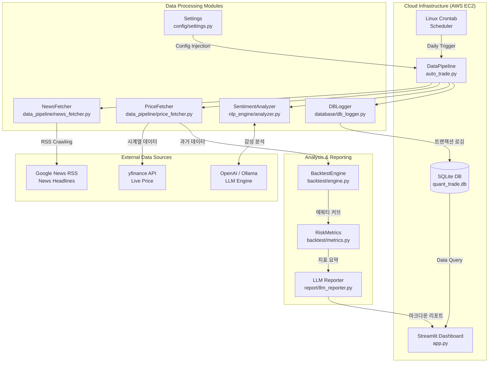

# 📈 Financial Data Intelligence Pipeline
### LLM 기반 시장 데이터 분석 및 리포트 자동화 시스템


금융 시계열 데이터를 수집·분석하고, 정량 규칙 기반 전략의 성과를 백테스트한 뒤, LLM을 활용해 리스크 분석 리포트를 자동 생성하는 **Full-Stack 데이터 파이프라인**입니다.

---

## 📊 실시간 데이터 분석 대시보드 (Live Dashboard)

*(시스템이 수집한 시계열 데이터와 백테스트 성과를 시각화합니다.)*


---

## 🏗 시스템 아키텍처 (Data Pipeline)



---

## 📁 프로젝트 구조

```
nlp-quant-trade/
├── config/
│   └── settings.py              # 중앙 집중형 설정 허브 (환경 분기 + 전략 파라미터)
├── data_pipeline/
│   ├── price_fetcher.py         # yfinance 시계열 데이터 + RSI/MACD 기술적 지표
│   └── news_fetcher.py          # Google News RSS 뉴스 크롤러
├── nlp_engine/
│   └── analyzer.py              # LLM 감성 분석 (OpenAI / Ollama 스위칭)
├── database/
│   └── db_logger.py             # SQLite 트랜잭션 로깅 (WAL 모드)
├── backtest/
│   ├── engine.py                # 이터레이티브 백테스트 (Look-ahead 편향 방어)
│   └── metrics.py               # 리스크 지표 (CAGR, MDD, Sharpe, 승률, 손익비)
├── report/
│   └── llm_reporter.py          # LLM 기반 성과 리포트 자동 생성
├── notifications/
│   └── telegram.py              # 텔레그램 실시간 알림
├── tests/                       # 54개 단위 테스트
│   ├── test_analyzer.py         # LLM 파싱 방어 (10개)
│   ├── test_decision_tree.py    # 의사결정 경계값 (14개)
│   ├── test_backtest.py         # 백테스트 & 리스크 지표 (22개)
│   ├── test_news_fetcher.py     # 뉴스 크롤링 실패 방어 (5개)
│   └── test_db_logger.py        # DB 무결성 (3개)
├── auto_trade.py                # 데이터 수집 & 분석 파이프라인
├── app.py                       # Streamlit 대시보드
└── requirements.txt
```

---

## 🔬 핵심 기술 구현 사항

### 1. 하이브리드 시그널 엔진 (정성 + 정량)
LLM의 텍스트 감성 점수에만 의존하지 않고, RSI(과매수/과매도)와 MACD(추세 모멘텀) 지표를 교차 검증합니다. 뉴스가 호재라도 차트가 과열 상태(RSI ≥ 70)이면 기계적으로 시그널을 보류하여 거짓 신호(Whipsaw) 리스크를 수학적으로 통제합니다.

### 2. 리스크 지표 기반 성과 분석
단순 수익률이 아닌 검증된 정량 지표로 전략을 평가합니다:
- **CAGR**: 연평균 복리 수익률
- **MDD**: 최대 낙폭 — 포트폴리오 꼬리 위험(Tail Risk) 정량화
- **Sharpe Ratio**: 위험 대비 수익률 — 변동성 보정 후 성과 측정
- **벤치마크 Alpha**: S&P500 대비 초과 수익 검증

### 3. Look-ahead 편향 방어 백테스트
이터레이티브 순회(`df.iloc[:i+1]`)를 사용하여 각 시점에서 미래 데이터 접근을 구조적으로 차단합니다. 감성 점수는 몬테카를로 시뮬레이션(정규분포 N(0.1, 0.3))으로 생성하여 LLM API 호출 비용을 절감하면서도 전략 로직을 검증합니다.

### 4. LLM 기반 분석 리포트 자동화
LLM이 직접 매매 판단을 하지 않고, **정량 백테스트 결과를 사람이 이해하기 쉬운 리포트로 요약**하는 역할만 수행합니다. 3중 방어막(JSON 모드 강제 + 파싱 예외 처리 + Pydantic 범위 검증)으로 LLM 응답의 비결정적 붕괴를 방어합니다.

### 5. 54개 단위 테스트 (pytest)
LLM 응답 파싱 방어, 의사결정 경계값, 리스크 지표 수학적 정확성, 뉴스 크롤링 실패 방어, DB 무결성 등 핵심 리스크 지점을 54개 테스트 케이스로 커버합니다.

```bash
pytest tests/ -v
# 54 passed ✅
```

---

## 🛠 트러블슈팅 (Engineering Challenges)

### 1. 단일 시그널의 한계 극복 (Whipsaw 방어)
- **문제**: LLM 감성 점수만으로는 홍보성 기사에 과민 반응하여 고점 매수를 시도하는 결함 발생
- **해결**: `[NLP 감성 + RSI + MACD]` 다중 조건부 의사결정 트리를 구축하여 거짓 신호를 수학적으로 통제

### 2. 로컬 LLM의 비결정적 JSON 붕괴 방어
- **문제**: Llama-3가 프롬프트 지시를 무시하고 비정형 텍스트를 반환하여 파이프라인 전체가 `JSONDecodeError`로 마비
- **해결**: 3중 방어막 구축 — (1) `response_format={"type": "json_object"}` 강제, (2) `json.loads` + `try-except` 파싱 실패 시 중립값 대체, (3) `Pydantic` 모델로 -1.0~1.0 범위 강력 검증

### 3. 시계열 데이터 결측치 정합성 유지
- **문제**: 휴장일/통신 지연으로 주가 데이터에 NaN 발생 → 이동평균 지표 산출 오류
- **해결**: Forward Fill(`ffill()`) 방식으로 직전 유효 체결가를 현재 가격으로 인식하는 시장 특성을 반영, Look-ahead 편향과 시계열 왜곡을 동시 방어

### 4. 프론트-백엔드 스키마 불일치 방어
- **문제**: 데이터 형식 변동 시 대시보드가 `KeyError`로 크래시
- **해결**: 컬럼 교집합 추출(`[col for col in target_cols if col in df.columns]`)로 방어적 프로그래밍 적용

### 5. 아키텍처 리팩토링 (God Function → OOP)
- **문제**: 140줄 단일 함수에 인증~분석~기록이 혼재되어 단위 테스트 및 유지보수 불가능
- **해결**: `TradingEngine` OOP 클래스로 전면 리팩토링, 매수/매도 95% 코드 중복을 `_execute_order()`로 통합 제거

---

## 🚀 배포 명세서 (Deployment)

### 1. Clone & Environment Setup
```bash
git clone https://github.com/bae-kh/nlp-quant-trade.git
cd nlp-quant-trade
python3 -m venv venv
source venv/bin/activate
pip install -r requirements.txt
```

### 2. 환경 변수 설정
```bash
cp .env.example .env
nano .env    # 실제 API 키 입력
```

### 3. 테스트 실행
```bash
pytest tests/ -v    # 54 passed ✅
```

### 4. 대시보드 서빙
```bash
nohup streamlit run app.py --server.port 8501 --server.address 0.0.0.0 &
```

### 5. 배치 스케줄러 (Crontab)
```bash
crontab -e
# 매일 23:35 (KST) 자동 실행
35 23 * * 1-5 cd /home/ubuntu/nlp-quant-trade && /home/ubuntu/nlp-quant-trade/venv/bin/python auto_trade.py >> cron_execution.log 2>&1
```
