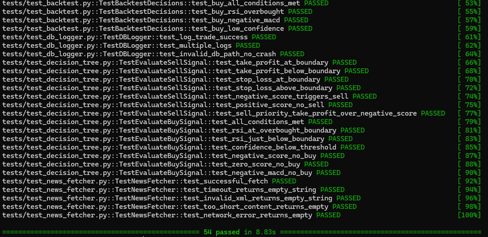
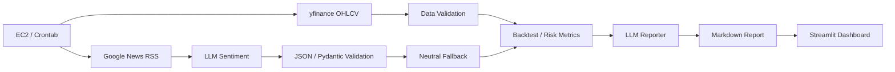

# LLM Financial Reporting Pipeline


금융 시계열 데이터와 뉴스 데이터를 수집하고, 정량 지표와 LLM sentiment 결과를 검증한 뒤 **Markdown report와 Streamlit dashboard**로 제공하는 Python reporting pipeline입니다.

LLM은 뉴스 감성 구조화와 report 생성에 사용하며, CAGR·MDD·Sharpe 등 정량 지표는 코드로 계산합니다. 이 프로젝트의 핵심은 자동 주문이 아니라 **데이터 수집 → 검증 → 분석 → 문서 생성 → batch execution**으로 이어지는 reporting workflow입니다.

> 이 프로젝트는 투자 자문·투자 추천·실전 자동매매 성과 검증을 목적으로 하지 않습니다. 백테스트 결과는 과거 데이터 기반 시뮬레이션입니다.

## Highlights

- `yfinance` 기반 OHLCV 수집
- Google News RSS 기반 뉴스 수집
- OpenAI / Ollama 기반 sentiment analysis
- JSON parsing, Pydantic validation, neutral fallback
- CAGR, MDD, Sharpe, benchmark comparison 코드 기반 계산
- LLM 실패 시 fallback report 생성
- Markdown report 자동 생성
- Streamlit dashboard
- EC2 / Linux Crontab scheduled batch
- pytest 54개 통과

---

## 1. Demo

| Streamlit Dashboard | Generated Report | Test Result |
|---|---|---|
|  |  |  |

- [Sample Market Report](./reports/sample_market_report.md)

화면과 sample report는 reporting workflow의 산출물 형식을 보여주기 위한 evidence입니다.

---

## 2. Scope and Boundaries

| 구분 | 범위 |
|---|---|
| Data Collection | yfinance OHLCV, Google News RSS |
| LLM Usage | 뉴스 sentiment 구조화, Markdown report 생성 |
| Validation | JSON parsing, Pydantic range validation, fallback |
| Quantitative Analysis | RSI, MACD, CAGR, MDD, Sharpe, benchmark |
| Output | Markdown report, Streamlit dashboard |
| Batch | EC2 / Crontab scheduled execution |
| Test | pytest 54개 |
| Out of Scope | 투자 추천, 실전 자금 운용 성과, production trading |

KIS 관련 코드는 report pipeline의 핵심이 아니라 optional paper/mock execution 실험 영역으로 분리합니다.

---

## 3. Architecture



Main flow:

```text
Price Data + News Data
→ Validation
→ Sentiment Analysis
→ Backtest / Risk Metrics
→ LLM Report Generation
→ Markdown Report
→ Streamlit Dashboard
```

---

## 4. Data Collection

### 4.1 Price Data

`data_pipeline/price_fetcher.py`

- `yfinance` 기반 OHLCV 수집
- RSI(14), MACD 계산
- 휴장일·결측치 방어를 위한 forward fill
- MultiIndex 자동 평탄화

```python
df = price_fetcher.get_daily_data(
    ticker="TSLA",
    start="2020-01-01",
    end="2022-12-31",
)
```

### 4.2 News Data

`data_pipeline/news_fetcher.py`

- Google News RSS headline 수집
- API key 없이 동작하는 RSS 기반 구조
- 빈 응답, timeout, parse error, request error 처리
- 수집된 headline을 sentiment analysis 입력으로 사용

---

## 5. LLM Usage and Output Validation

### 5.1 Sentiment Analysis

`nlp_engine/analyzer.py`

LLM은 뉴스 텍스트를 sentiment score와 confidence로 구조화합니다.

```json
{
  "sentiment_score": 0.25,
  "confidence": 82
}
```

### 5.2 Output Defense

| 단계 | 방어 방식 |
|---|---|
| 1 | JSON 형식 요청 |
| 2 | `json.loads`와 예외 처리 |
| 3 | Pydantic 범위 검증 |
| 4 | 실패 시 neutral sentiment fallback |

LLM 호출 성공 여부만 확인하지 않고, downstream pipeline이 처리할 수 있는 구조인지 검증합니다.

### 5.3 Backend Switching

```text
USE_LOCAL_LLM=False
→ OpenAI API

USE_LOCAL_LLM=True
→ Ollama local LLM
```

### 5.4 Fallback Report

LLM report generation이 실패하면 정량 지표를 기반으로 기본 Markdown report를 생성해 전체 pipeline이 중단되지 않도록 구성했습니다.

---

## 6. Quantitative Metrics

`backtest/metrics.py`

| Metric | Description |
|---|---|
| CAGR | 연평균 복리 수익률 |
| MDD | 최대 낙폭 |
| Sharpe Ratio | 변동성 대비 성과 |
| Benchmark Comparison | benchmark 대비 상대 성과 |
| Transaction Cost | 수수료·슬리피지 가정 |

백테스트는 미래 데이터를 참조하지 않도록 각 시점까지의 데이터만 사용합니다.

```python
for i in range(len(df)):
    current_data = df.iloc[: i + 1]
```

정량 지표 계산은 코드로 수행하고, LLM은 결과를 사람이 읽을 수 있는 문장으로 설명하는 역할만 담당합니다.

---

## 7. Report Generation

이 프로젝트의 핵심 기능입니다.

```text
Backtest Metrics
+ Risk Metrics
+ Sentiment Summary
+ Simulation Event Summary
        ↓
LLMReporter.generate_report()
        ↓
Markdown Report
```

생성되는 report 구성:

1. Data Summary
2. Indicator Summary
3. News Sentiment Summary
4. Backtest Metrics
5. Risk Notes
6. LLM Commentary
7. Limitations

### CLI

```bash
python generate_report.py --ticker TSLA
```

기간 지정:

```bash
python generate_report.py \
  --ticker TSLA \
  --start 2020-01-01 \
  --end 2022-12-31
```

뉴스 cache 사용:

```bash
python generate_report.py \
  --ticker TSLA \
  --use-news-cache
```

로컬 LLM 사용:

```bash
python generate_report.py \
  --ticker TSLA \
  --local-llm
```

출력 경로 지정:

```bash
python generate_report.py \
  --ticker TSLA \
  --output reports/generated/report_TSLA.md
```

---

## 8. Dashboard and Batch Execution

### 8.1 Streamlit Dashboard

```bash
streamlit run app.py --server.port 8501
```

Dashboard 구성:

- pipeline 실행 상태
- 주가 흐름
- 주요 risk metric
- backtest equity curve
- benchmark comparison
- SQLite event log
- generated report 확인

### 8.2 Scheduled Batch

EC2 Linux 환경에서 Crontab으로 report generation을 예약 실행했습니다.

```bash
35 23 * * 1-5 \
cd /home/ubuntu/llm-financial-reporting-pipeline && \
/home/ubuntu/llm-financial-reporting-pipeline/venv/bin/python \
generate_report.py \
--ticker TSLA \
--output reports/generated/latest_report.md \
>> cron_execution.log 2>&1
```

---

## 9. Testing

```bash
pytest tests/ -v
```

```text
54 passed
```

검증 범위:

- LLM JSON parsing
- Pydantic range validation
- timeout / fallback
- news collector error handling
- backtest metric calculation
- look-ahead defense
- SQLite logging
- report generation flow

pytest screenshot:

- [Test Result](./assets/pytest_result.png)

---

## 10. Project Structure

```text
llm-financial-reporting-pipeline/
├── backtest/                     # simulation and risk metrics
├── config/                       # centralized settings
├── data_pipeline/                # price and news collectors
├── database/                     # SQLite event logger
├── nlp_engine/                   # LLM sentiment analysis
├── report/                       # Markdown report generation source
├── reports/
│   ├── sample_market_report.md
│   └── generated/
├── tests/                        # pytest
├── notifications/               # optional execution notification
├── optional_execution/          # paper/mock broker experiment
│   └── auto_trade.py
├── assets/
│   ├── dashboard.png
│   ├── sample_report.png
│   └── pytest_result.png
├── docs/
│   ├── architecture.md
│   ├── limitations.md
│   └── batch_execution.md
├── .env.example
├── .gitignore
├── app.py
├── generate_report.py
├── run_backtest_demo.py
├── requirements.txt
└── README.md
```

`report/`는 report 생성 code, `reports/`는 sample과 generated document를 관리합니다.

---

## 11. Getting Started

### 11.1 Clone and Install

```bash
git clone https://github.com/bae-kh/llm-financial-reporting-pipeline.git
cd llm-financial-reporting-pipeline

python3 -m venv venv
source venv/bin/activate

pip install -r requirements.txt
cp .env.example .env
```

Windows PowerShell:

```powershell
python -m venv venv
.\venv\Scripts\Activate.ps1
pip install -r requirements.txt
Copy-Item .env.example .env
```

### 11.2 Environment Variables

| Variable | Description |
|---|---|
| `OPENAI_API_KEY` | OpenAI sentiment/report generation |
| `USE_LOCAL_LLM` | OpenAI / Ollama 전환 |
| `TELEGRAM_BOT_TOKEN` | optional notification |
| KIS variables | optional paper/mock execution only |

`.env`에는 실제 secret을 저장하고 Git에 commit하지 않습니다.

---

## 12. Agentic AI Usage and Human Validation

Agentic AI는 요구사항 분해, 구현 초안, 오류 원인 탐색, test case 아이디어, README 구조화에 활용했습니다.

### Agentic AI가 보조한 부분

- pipeline task 분해
- collector와 validation code 초안
- LLM output parsing 아이디어
- report template 초안
- test case 아이디어
- 문서 구성과 troubleshooting 정리

### 직접 판단하고 검증한 부분

- 투자 추천이 아닌 reporting workflow로 scope 결정
- 정량 지표 계산과 LLM 설명 역할 분리
- LLM output validation과 fallback 적용
- sample report 결과 확인
- pytest 54개 실행
- EC2 / Crontab batch 실행
- 과장된 성과·투자 수익 주장 제거

Raw prompt나 내부 system rule을 공개 evidence로 사용하지 않고, 실행 가능한 코드·test·산출물로 Agentic AI 활용 결과를 검증합니다.

---

## 13. Limitations

- Google News RSS source bias와 수집 누락 가능성
- LLM output의 비결정성
- JSON/Pydantic/fallback으로도 hallucination을 완전히 제거할 수 없음
- 과거 데이터 기반 simulation
- 현재 TSLA 중심의 단일 ticker 범위
- walk-forward validation 미구현
- batch failure monitoring 제한
- production deployment와 observability 미구현
- KIS 관련 기능은 optional paper/mock experiment

---

## 14. Future Work

- multi-symbol reporting
- walk-forward validation
- source diversification
- stricter schema enforcement
- retry / timeout policy 강화
- generated report versioning
- batch failure alert
- centralized logging
- dashboard와 report archive 개선

---

## 15. Core Takeaway

이 프로젝트의 핵심은 LLM 호출 자체가 아니라, 정형·비정형 데이터를 수집하고 출력값을 검증한 뒤 사람이 읽을 수 있는 문서와 dashboard로 변환한 경험입니다.

```text
Structured Data
+ Unstructured News
+ Code-based Metrics
+ Validated LLM Output
+ Automated Report
= Usable Reporting Workflow
```
