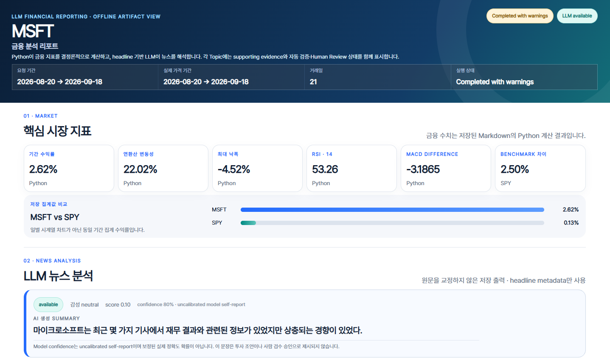
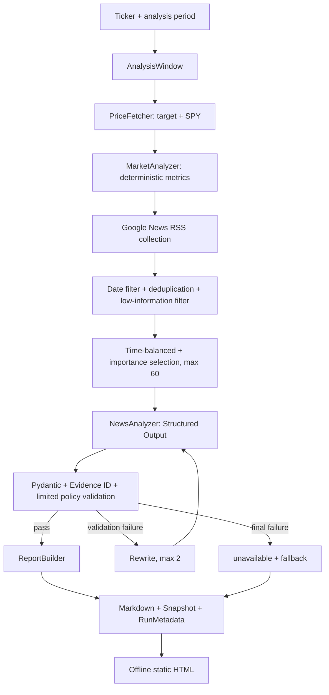

# LLM Financial Reporting

> Python으로 금융 지표를 결정론적으로 계산하고, headline 기반 LLM 뉴스 분석과 supporting evidence를 결합한 재현 가능한 금융 리포팅 파이프라인입니다.

가격 계산, 외부 데이터 수집, LLM 생성, 검증·재작성, artifact 저장을 하나의 workflow로 연결했습니다. 핵심은 모든 작업을 LLM에 맡기는 것이 아니라, 정확성과 재현성이 필요한 영역은 Python으로 고정하고 비정형 뉴스 해석만 LLM에 제한하는 것입니다.

연구·교육 목적의 프로젝트이며 투자 조언, 종목 추천 또는 자동 주문을 제공하지 않습니다.



## Key Highlights

- Python으로 기간 수익률, 연환산 변동성, MDD, RSI(14), MACD difference 계산
- 대상 종목과 동일한 실제 거래일 기준 SPY benchmark 비교
- Google News RSS headline metadata 수집, 기간 필터, 중복·저정보성 페이지 제거
- 날짜 균형과 사건 중요도를 결합해 최대 60개 headline 선택
- OpenAI Structured Output으로 Summary, sentiment, Topic, supporting article ID 생성
- Pydantic·allow-list·제한된 사건 규칙 검증과 최대 2회 재작성 후 fail-closed fallback
- Markdown·News Snapshot·RunMetadata와 오프라인 정적 HTML 리포트 생성

## Why this architecture?

| 책임 | 구현 | 이유 |
|---|---|---|
| Financial metrics | Deterministic Python | 같은 입력에서 같은 계산 결과를 재현하고 단위 테스트로 검증 |
| Qualitative news interpretation | LLM | 여러 headline의 비정형 사건과 방향을 구조화된 텍스트로 요약 |
| Validation, policy, evidence | Deterministic checks | 허용되지 않은 ID, 제한된 사건 의미 변경, 금지 표현과 실패 상태를 코드로 통제 |

LLM은 가격 지표를 계산하지 않습니다. Python validator도 일반적인 자연어 entailment를 완전히 판단한다고 가정하지 않습니다. 각 컴포넌트가 잘할 수 있는 범위를 분리하고, 자동 검증과 Human Review를 별도 상태로 기록합니다.

## Architecture


```mermaid
flowchart TD
    A[Ticker + analysis period] --> B[AnalysisWindow]
    B --> C[PriceFetcher: target + SPY]
    C --> D[MarketAnalyzer: deterministic metrics]
    D --> E[Google News RSS collection]
    E --> F[Date filter + deduplication + low-information filter]
    F --> G[Time-balanced + importance selection, max 60]
    G --> H[NewsAnalyzer: Structured Output]
    H --> I[Pydantic + Evidence ID + limited policy validation]
    I -->|pass| J[ReportBuilder]
    I -->|validation failure| K[Rewrite, max 2]
    K --> H
    I -->|final failure| L[unavailable + fallback]
    J --> M[Markdown + Snapshot + RunMetadata]
    L --> M
    M --> N[Offline static HTML]
```

시장 분석은 필수 단계이고 뉴스·LLM 분석은 부분 실패가 가능한 선택 단계입니다. 세부 책임과 실패 경계는 [Architecture](docs/architecture.md)와 [Failure Handling](docs/failure-handling.md)에 정리했습니다.

## Example Output

정적 HTML은 저장된 Markdown, News Snapshot, RunMetadata만 읽으며 외부 API를 다시 호출하지 않습니다.

- KPI와 benchmark는 Python 계산 결과입니다.
- 각 LLM Topic은 Snapshot의 supporting headline과 연결됩니다.
- `ID validated`는 ID가 선택 입력/Snapshot에 존재한다는 뜻이며 의미적 근거 적합성을 보장하지 않습니다.
- Human Review 상태와 자동 검증 상태를 분리해 표시합니다.

대표 화면은 `1920×1080` 첫 viewport를 기준으로 하며 Hero, KPI, benchmark, LLM Summary와 첫 Topic 일부가 보이도록 구성했습니다.

## Validation & Failure Handling

LLM 출력은 다음 순서로 처리합니다.

1. OpenAI Structured Output parsing
2. Pydantic schema 검증
3. 선택된 supporting article ID allow-list 검증
4. 차량 인도 거점·인도 대수·리콜 등 제한된 사건 grounding 규칙
5. 금지 표현과 일부 headline 정책 검사
6. 검증 실패 시 오류 사유를 전달해 최대 2회 재작성
7. 세 번째 결과도 실패하면 `available=false`, `unavailable`, `fallback_used=true`

뉴스 부재·API 오류·검증 실패는 정상적인 `neutral` 분석과 구분됩니다. 명백한 옵션 계약 목록, 커뮤니티 계약 페이지, 순수 차트·시세 페이지는 LLM 입력 전에 보수적으로 제외합니다.

현재 validator는 제한된 deterministic rule set입니다. 일반적인 Topic-level evidence relevance, 번역 뉘앙스, 인과관계와 unsupported claim 전체를 보장하지 않습니다.

## Evaluation & Experiments

Evaluation v2는 Dataset version/hash, attempt telemetry, case별 grading, validator reliability와 Human Review 자료를 같은 `eval_run_id`로 연결합니다. Validator pass rate와 semantic accuracy는 별도 지표로 취급합니다.

주요 검증 기록:

- TSLA 실제 headline 5개 development dataset과 별도 legacy synthetic 6-case 유지
- First-pass·Final-pass validator pass, Rewrite Rescue, Attempt 수, Unavailable Rate 집계 기반 구현
- Prompt v3·Validator v2 조합으로 MSFT와 AAPL Live E2E를 각각 1회 실행하고 저장 artifact를 Offline 품질 감사
- Prompt v3/v4를 MSFT·AAPL의 동일한 재구성 60-headline 입력과 동일 validator로 비교
- 고정 Snapshot 비교 4개 case에서 총 11회 generation attempt 기록
- MSFT는 v3·v4 모두 `unavailable`, AAPL은 v3·v4 모두 `available`
- AAPL v4에서 동일 buyback headline 중복 인용이 사라진 사례를 관찰했지만, unrelated evidence와 unsupported claim 후보는 남음

이 결과는 development diagnostic입니다. Prompt v4의 일반화된 성능 향상이나 공식 semantic accuracy를 의미하지 않습니다. Production 기본값은 Prompt v3이며 v4는 experimental opt-in으로 보존합니다.

- [Evaluation v2 설계와 채점 경계](docs/evaluation_v2.md)
- [Prompt v3/v4 고정 Snapshot 비교](docs/prompt-v3-v4-fixed-snapshot-comparison.md)
- [실험 기록](docs/experiment-log.md)
- [MSFT E2E 품질 감사](docs/msft-e2e-quality-audit.md)
- [저정보성 페이지 필터 후속 검증](docs/msft-e2e-low-information-filter-followup.md)

## Limitations

- 기사 본문이 아니라 headline·발행일·출처 metadata만 분석합니다.
- Google News RSS의 전체 언론사 coverage와 완전 수집을 보장하지 않습니다.
- Supporting ID validity는 Topic의 semantic evidence correctness가 아닙니다.
- Model confidence는 uncalibrated self-report이며 실제 정확도 확률이 아닙니다.
- Prompt와 validator는 모든 의미·번역·인과관계 오류를 탐지하지 못합니다.
- 일부 Production 경로는 선택된 60개 ID 전체를 별도 artifact로 직접 저장하지 않습니다.
- 출력은 투자 판단이나 자동 거래에 사용하기 위한 시스템이 아닙니다.

자세한 범위는 [Limitations and Disclaimer](docs/limitations.md)를 참고하세요.

## Project Structure

```text
analysis/       금융 지표, headline policy, LLM 분석·검증·재작성
data_pipeline/  yfinance 가격과 Google News RSS 수집
workflow/       분석 기간, 전체 orchestration, Snapshot·RunMetadata
report/         Markdown 및 정적 HTML 생성
agent/          기존 workflow를 호출하는 제한된 3-tool interface
evaluation/     Dataset v2, telemetry, runner, grader, 고정 Snapshot 비교
evals/          평가 schema, dataset, fixture, template
tests/          unit·integration·offline regression tests
docs/           설계, 실험, 감사, Human Review 기록
```

## Quick Start

Python 3.11 이상을 권장하며 현재 의존성과 전체 테스트는 Python 3.13.9에서 확인했습니다.

### 1. 설치

```powershell
git clone https://github.com/bae-kh/llm-financial-reporting-pipeline.git
cd llm-financial-reporting-pipeline

python -m venv venv
.\venv\Scripts\Activate.ps1
pip install -r requirements.txt
pip install -r requirements-dev.txt
pip install ruff==0.12.0
Copy-Item .env.example .env
```

`.env`의 다음 값은 Live LLM 분석에만 필요합니다. 실제 키는 Git에 추가하지 않습니다.

```dotenv
OPENAI_API_KEY=your_api_key_here
```

### 2. 금융 리포트 생성

```powershell
python .\generate_report.py --ticker MSFT --analysis-days 30 --as-of-date 2026-09-18
```

기본 출력은 Git에서 제외된 `reports/generated/`에 저장됩니다. 실제 yfinance, Google News RSS와 OpenAI를 사용하므로 네트워크와 API 비용이 발생할 수 있습니다.

### 3. 저장 artifact를 정적 HTML로 변환

```powershell
$metadata = Get-ChildItem .\reports\generated\run_metadata\run_*.json |
  Sort-Object LastWriteTime -Descending |
  Select-Object -First 1

python .\generate_static_html_report.py --metadata $metadata.FullName
```

HTML 변환은 저장 artifact만 읽으며 OpenAI, yfinance, RSS를 호출하지 않습니다. Prompt·Validator·Human Review provenance는 선택적 `--context` JSON이 있을 때만 표시됩니다.

### 4. 테스트와 정적 검사

```powershell
python -m pytest -q
python -m ruff check .
git diff --check
```

현재 로컬 검증 결과:

```text
pytest: 272 passed
Ruff: passed
git diff --check: passed
```

자동 테스트는 fake provider와 stub client를 사용하므로 OpenAI·yfinance·RSS를 호출하지 않습니다.

## Optional Agent Interface

`agent/financial_research_agent.py`는 이미 검증된 workflow를 호출하는 제한된 Tool Calling 계층입니다. 금융 계산을 직접 수행하지 않으며 주문·종목 추천 도구를 제공하지 않습니다.

```powershell
python .\run_financial_agent.py "MSFT를 2026-09-18 기준 최근 30일로 분석해서 리포트를 만들어줘"
```

허용 도구는 report 생성, 과거 run 상태 조회, 프로젝트 금융 지표 설명의 세 가지입니다.

## Disclaimer

이 프로젝트는 LLM application architecture, validation, evaluation과 failure handling을 학습·시연하기 위한 포트폴리오입니다. 생성 결과는 투자 자문, 매수·매도 신호 또는 미래 성과 보장을 제공하지 않습니다.
